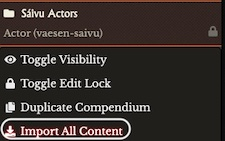
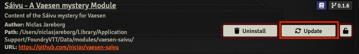

# vaesen-saivu

A [Foundry VTT](https://foundryvtt.com/) module with the content of the [Sáivu mystery](https://www.drivethrurpg.com/product/350930/Saivu--A-Vaesen-Mystery) for the Vaesen RPG, published under the [Free League Workshop](https://www.drivethrurpg.com/cc/30/free-league-work-shop).

If you have not done so already, please consider paying a small sum for the [pdf download at DriveThruRPG](https://www.drivethrurpg.com/product/350930/Saivu--A-Vaesen-Mystery). Any proceeds will be donated to the [Sami Memorial Fund](https://densamiskaminnesfonden.se/) (Samiska Minnesfonden).

## The mystery

*Soon after we started to get into the mountain, the setbacks began to come one after the other. Tunnels that were started suddenly collapsed for no apparent reason. Several miners fell ill. Equipment broke down. To date, we have made very little progress. I know it is much to ask of you to come to me here in the wilderness. But if we do not resolve this situation, we are lost!*

An old childhood friend asks for help in solving a series of unexplained events at a newly started mine high up north in the Swedish mountains. The player characters confronts a type of Vaesen they have never encountered before, and that they might have to travel to another world to contact.

The mystery centres around racism and colonialism towards the Sami, and the player characters have to choose if they should be loyal to the Swedes or solve the mystery by helping a group of Sami.

## Project home

https://github.com/nicjar/vaesen-saivu

## Recent changes

_See [Updating content](#updating-content) below if you want to update a previous installation._

### v0.1.6

_3 January 2023_

- Improved the resolution of the map of the Glibbo scene
- Updated the journal entries to Foundry v10
- Removed the dependency of the Journal Anchor Links module

## Installation

Unfortunately, I don't have the time to script installation and updating of the module content, so this has to be done manually. This is really straight-forward, see instructions below.

### Manifest URL

`https://github.com/nicjar/vaesen-saivu/releases/latest/download/module.json`

### Installation step-by-step guide

#### Install Module

* In your Foundry instance, go to the *Add-on Modules* tab of Configuration and Setup.
* Click the *Install Module* button at the bottom of the screen.
* Paste the the [Manifest URL](#manifest-url) above into the *Manifest URL:* textbox at the bottom of the Install Module pop-up window. Click Install.

#### Add module content to your Vaesen world

* Launch your Vaesen world, go to _Game Settings_, then _Manage Modules_.
* Select the _Sáivu - A Vaesen mystery Module_ module. Click the _Save Module Settings_ button.
* Go to the _Compendium Packs_ tab. For **each** of the Compendiums, right click to get pop-up menu and select _Import All Content_.

	

  * **Note!** Be sure to select the _Keep Document IDs?_ checkbox in the _Import All Content_ pop-up window, otherwise Journal Links etc will not work. Click the _Yes_ button.

	

* Repeat for the rest of the Compendiums.
* That's it!

### Updating Content

* In your Foundry instance, go to the *Add-on Modules* tab of Configuration and Setup.
* Scroll down to the Sáivu module, and click the *Update* button on the right hand side of the screen.

* When the module is updated to a new version, one or more compendiums will be updated. But the already imported content will **not** be updated automatically. You will have to re-import the compendium content again using the instructions above.
  * To avoid duplications or loss of changes you've made, the best thing to do is do a clean re-install. Remove old content that you have not changed, and make copies of content that you have changed before re-importing.

## Dependencies

### Vaesen

To use this module you have to have a world created in your Foundry VTT instance that uses the free [Vaesen Foundry Game System](https://github.com/fvtt-fria-ligan/vaesen-foundry-vtt).

The vaesen-saivu module is **NOT** dependent on the [Vaesen - Official Core Rulebook module](https://freeleaguepublishing.com/en/store/?product_id=7092046200981) that is available for purchase, and does not use any assets from that module.

## Licence

This product was created under license. Vaesen and its logo are trademarks of Fria Ligan AB and Johan Egerkrans.

This work contains material that is copyright Fria Ligan AB, Johan Egerkrans and/or other authors. Such material is used with permission under the Community Content Agreement for Free League Workshop.

All other original material in this work is copyright 2021 by Niclas Jareborg and published under the Community Content Agreement for Free League Workshop.

